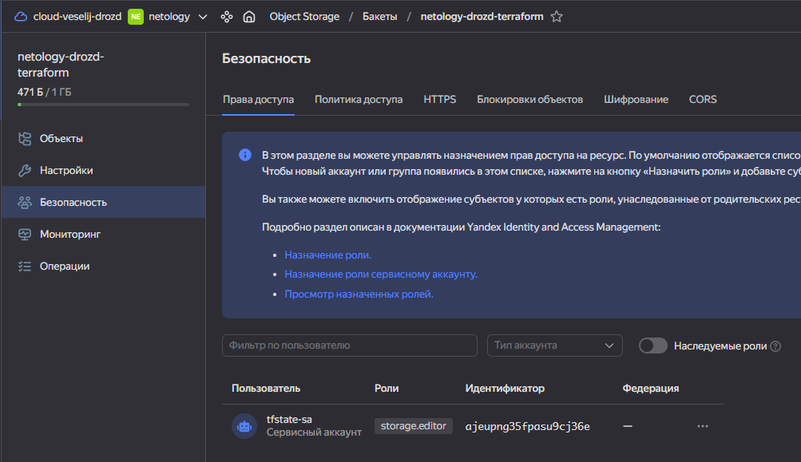
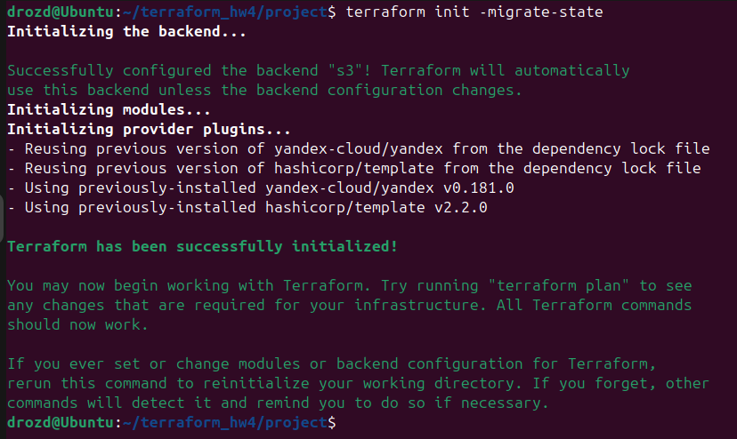
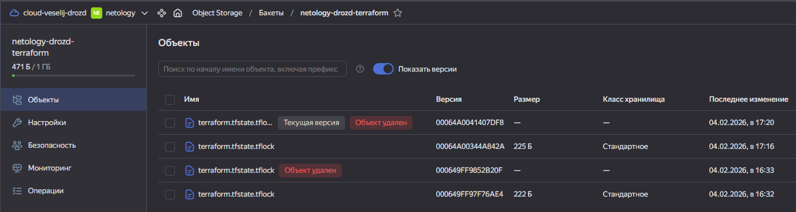
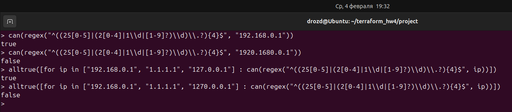

### Домашнее задание к занятию «Использование Terraform в команде» - Гривняшкин Р. В.

---

1.
- **`tflint`**

 - Отсутствие версии для провайдера. Может привести к неконсистентному состоянию.

	```
	Warning: Missing version constraint for provider "random" in `required_providers` (terraform_required_providers)

	  on passwords/main.tf line 8:
	   8: resource "random_password" "input_vms" {

	Reference: https://github.com/terraform-linters/tflint-ruleset-terraform/blob/v0.13.0/docs/rules/terraform_required_providers.md

	Warning: Missing version constraint for provider "template" in `required_providers` (terraform_required_providers)

	  on vms/main.tf line 64:
	  64: data "template_file" "cloudinit" {

	Reference: https://github.com/terraform-linters/tflint-ruleset-terraform/blob/v0.13.0/docs/rules/terraform_required_providers.md

	Warning: Missing version constraint for provider "yandex" in `required_providers` (terraform_required_providers)

	  on vms/providers.tf line 3:
	   3:     yandex = {
	   4:       source = "yandex-cloud/yandex"
	   5:     }

	Reference: https://github.com/terraform-linters/tflint-ruleset-terraform/blob/v0.13.0/docs/rules/terraform_required_providers.md
	```

 - Используется ссылка наназвание ветки репозитория модуля, а не тег. Нарушается принцип идемпотентности и воспроизводимости.

	```
	Warning: Module source "git::https://github.com/udjin10/yandex_compute_instance.git?ref=main" uses a default branch as ref (main) (terraform_module_pinned_source)

	  on vms/main.tf line 23:
	  23:   source         = "git::https://github.com/udjin10/yandex_compute_instance.git?ref=main"

	Reference: https://github.com/terraform-linters/tflint-ruleset-terraform/blob/v0.13.0/docs/rules/terraform_module_pinned_source.md

	Warning: Module source "git::https://github.com/udjin10/yandex_compute_instance.git?ref=main" uses a default branch as ref (main) (terraform_module_pinned_source)

	  on vms/main.tf line 46:
	  46:   source         = "git::https://github.com/udjin10/yandex_compute_instance.git?ref=main"

	Reference: https://github.com/terraform-linters/tflint-ruleset-terraform/blob/v0.13.0/docs/rules/terraform_module_pinned_source.md
	```
 - Задекларирована неиспользуемая переменная.

	```
	Warning: [Fixable] variable "public_key" is declared but not used (terraform_unused_declarations)

	  on vms/variables.tf line 3:
	   3: variable "public_key" {

	Reference: https://github.com/terraform-linters/tflint-ruleset-terraform/blob/v0.13.0/docs/rules/terraform_unused_declarations.md

	```

 - В ДЗ помимо вышеописанных предупреждений есть еще незадекларированные переменные.

	```
	Warning: [Fixable] variable "vm_web_name" is declared but not used (terraform_unused_declarations)

	  on project/variables.tf line 42:
	  42: variable "vm_web_name" {

	Reference: https://github.com/terraform-linters/tflint-ruleset-terraform/blob/v0.13.0/docs/rules/terraform_unused_declarations.md

	Warning: [Fixable] variable "vm_db_name" is declared but not used (terraform_unused_declarations)

	  on project/variables.tf line 49:
	  49: variable "vm_db_name" {

	Reference: https://github.com/terraform-linters/tflint-ruleset-terraform/blob/v0.13.0/docs/rules/terraform_unused_declarations.md
	```

- **`checkov`**

В ДЗ только проблемы с указанием ветки, а не тега или хэша коммита. В демонстрации такие же проблемы.

```
Check: CKV_TF_1: "Ensure Terraform module sources use a commit hash"
	FAILED for resource: marketing
	File: /project/main.tf:11-31

Check: CKV_TF_2: "Ensure Terraform module sources use a tag with a version number"
	FAILED for resource: marketing
	File: /project/main.tf:11-31

Check: CKV_TF_1: "Ensure Terraform module sources use a commit hash"
	FAILED for resource: analytics
	File: /project/main.tf:33-53

Check: CKV_TF_2: "Ensure Terraform module sources use a tag with a version number"
	FAILED for resource: analytics
	File: /project/main.tf:33-53
```

---

2.
- remote backend

[main.tf with s3 backend](./project/main.tf)





- lock error

	```
	Error: Error acquiring the state lock
	│ 
	│ Error message: operation error S3: PutObject, https response error
	│ StatusCode: 412, RequestID: 6a61ccf1bdd9a632, HostID: , api error
	│ PreconditionFailed: At least one of the pre-conditions you specified did not
	│ hold
	│ Lock Info:
	│   ID:        9d003cff-4568-a71d-04c3-d72b94b9c450
	│   Path:      netology-drozd-terraform/terraform.tfstate
	│   Operation: OperationTypeInvalid
	│   Who:       drozd@Ubuntu
	│   Version:   1.14.4
	│   Created:   2026-02-04 14:16:37.932688529 +0000 UTC
	│   Info:      
	│ 
	│ 
	│ Terraform acquires a state lock to protect the state from being written
	│ by multiple users at the same time. Please resolve the issue above and try
	│ again. For most commands, you can disable locking with the "-lock=false"
	```

- unlock

```
> terraform force-unlock 9d003cff-4568-a71d-04c3-d72b94b9c450
Do you really want to force-unlock?
  Terraform will remove the lock on the remote state.
  This will allow local Terraform commands to modify this state, even though it
  may still be in use. Only 'yes' will be accepted to confirm.

  Enter a value: yes

Terraform state has been successfully unlocked!

The state has been unlocked, and Terraform commands should now be able to
obtain a new lock on the remote state.

```



---

3.

[Изменение backend](https://github.com/VeselijDrozd/terraform_hw4/pull/2/changes/641e24e45d0f574134db7ebcd90ad8e4ea11685e)

[Исправление предупреждений](https://github.com/VeselijDrozd/terraform_hw4/pull/2/changes/056d4a9cd4f095816250e0311ad914b7f556c9af)

Я немного затупил. Я не делал apply, поэтому у меня изменений в terraform plan и не было.
Кроме того, я засунул в ref хэш последнего коммита из репозитория лекций, но потом поправил [здесь](https://github.com/VeselijDrozd/terraform_hw4/pull/2/changes/8eeaf0ad7785ba28c2c2255fded6be807b4ebdc7) после pr. Не ругайтесь пожалуйста.

---

4. Валидация

```
variable "ip_string" {
  type        = string
  description = "ip-адрес"
  
  validation {
    condition = can(regex(
      "^((25[0-5]|(2[0-4]|1\\d|[1-9]?)\\d)\\.?){4}$",
      var.ip_string
    ))
    error_message = "Not IP"
  }
}

variable "ip_list" {
  type        = list(string)
  description = "список ip-адресов"
  
  validation {
    condition = alltrue([
      for ip in var.ip_list : can(regex(
        "^((25[0-5]|(2[0-4]|1\\d|[1-9]?)\\d)\\.?){4}$",
        ip
      ))
    ])
    error_message = "Not IP"
  }
}
```


