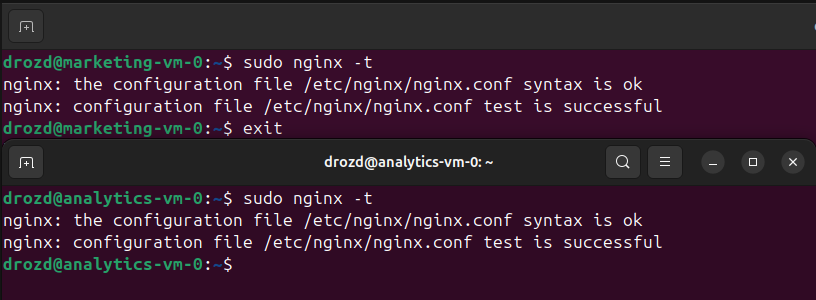
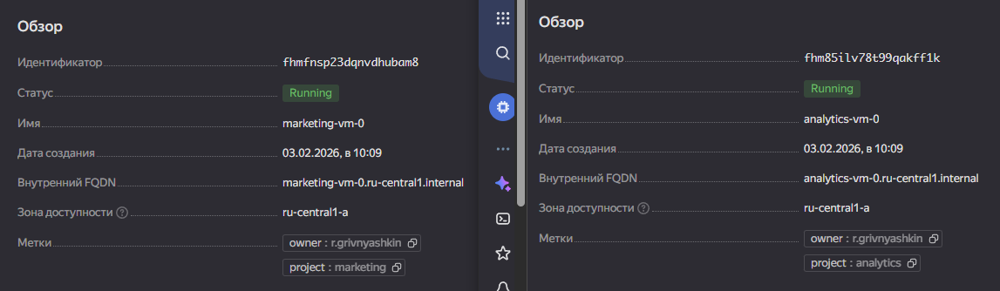
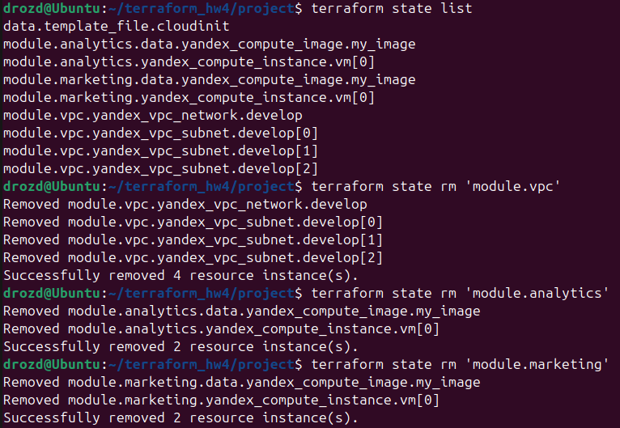
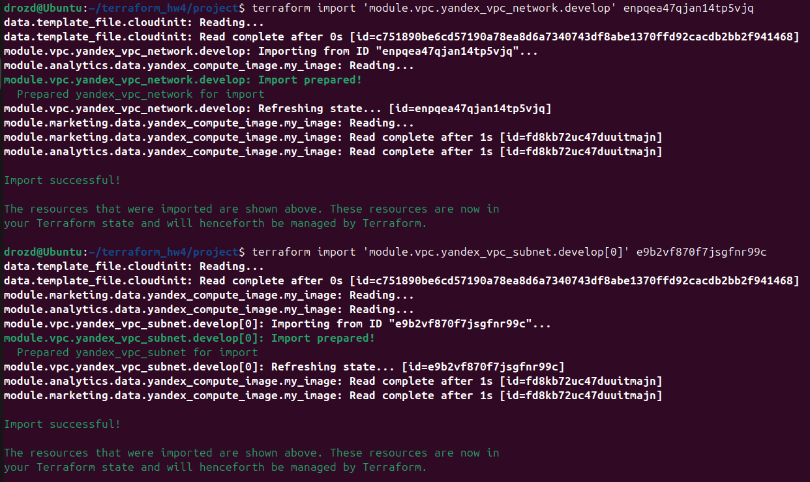
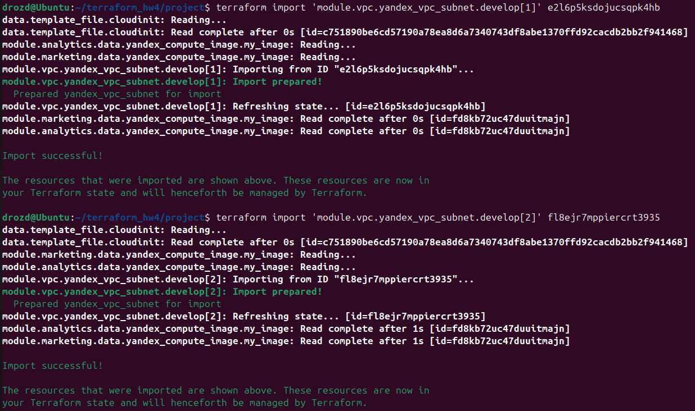
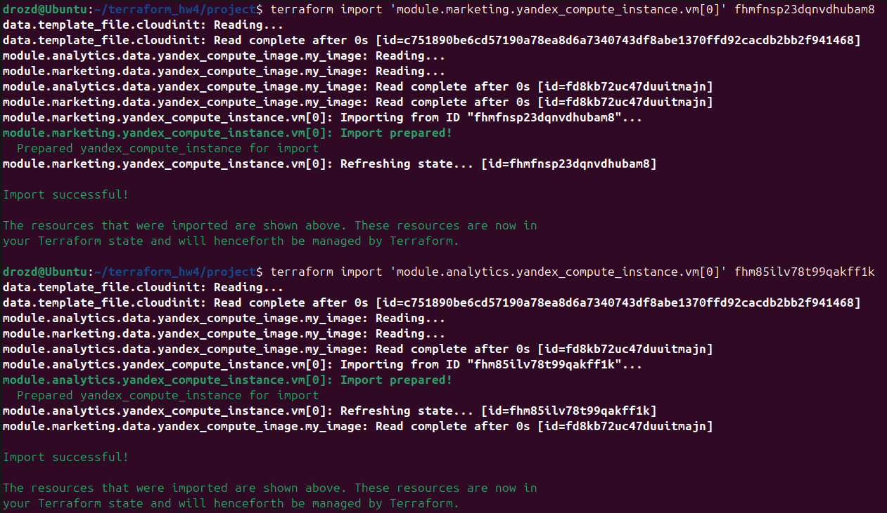
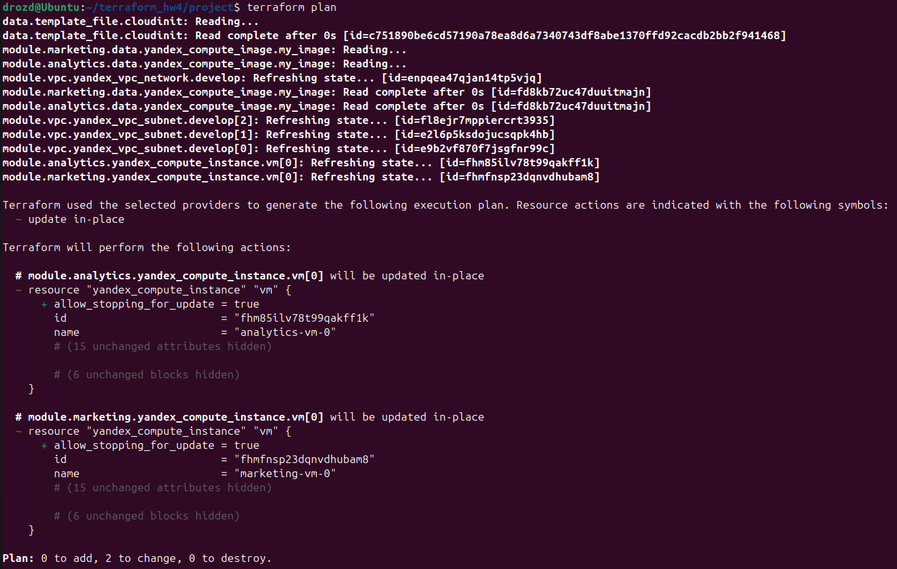

### Домашнее задание к занятию «Продвинутые методы работы с Terraform» - Гривняшкин Р. В.

---

1.




```
echo "module.marketing" | terraform console > files/module.marketing.hcl
echo "module.analytics" | terraform console > files/module.analytics.hcl

```
[Module marketing](./files/module.marketing.hcl)
[Module analytics](./files/module.analytics.hcl)

---

2 (4*). Я делал не по списку, поэтому я сразу сделал модуль vpc с динамическим определением зон доступности подсетей

```
echo "module.vpc" | terraform console > files/module.vpc.hcl
```
[Module VPC](./files/module.vpc.hcl)

[vpc main.tf](./project/vpc/main.tf)
[vpc variables.tf](./project/vpc/variables.tf)
[vps outputs.tf](./project/vpc/outputs.tf)

---

3.
Удаление ресурсов.



Добавление обратно.





`> terraform plan`


